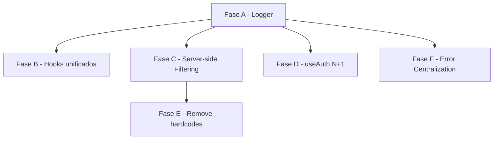

# Design — Backend & Performance Overhaul (002)

## Arquitetura de Logging

```
src/lib/logger.ts
  export const logger = {
    debug: (...args) => import.meta.env.DEV && console.log('[DEBUG]', ...args),
    info:  (...args) => import.meta.env.DEV && console.log('[INFO]',  ...args),
    warn:  (...args) => import.meta.env.DEV && console.warn('[WARN]',  ...args),
    error: (...args) => import.meta.env.DEV && console.error('[ERROR]', ...args),
  }
```

Em produção, todas as chamadas se tornam *no-ops*, sem custo de performance.

---

## Unificação de Hooks do Dashboard

**ANTES (5 hooks):**
```
useCorretoraDashboard.ts         → obsoleto
useCorretoraDashboardData.ts     → manter como source-of-truth
useCorretoraDashboardMetrics.ts  → obsoleto (mesma RPC)
useCorretoraDashboardActions.ts  → mover para dentro do principal
useCorretoraDashboardActionsDetailed.ts → obsoleto
```

**DEPOIS (1 hook):**
```
useCorretoraDashboardData.ts
  - useQuery → get_corretora_dashboard_metrics (dados)
  - useMutation → ações inteligentes (ativar, configurar plano)
  - Exporta: { data, isLoading, error, refetch, executarAcao }
```

---

## Correção de N+1 no useAuth

**ANTES:**
```
onAuthStateChange → setTimeout(0)
  → getUserProfile() [query 1: profiles]
    → getBrandingData()
      → [para empresa: query 2: profiles (novamente!), query 3: empresa_branding]
      → [para corretora: query 2: corretora_branding]
```

**DEPOIS:**
```
onAuthStateChange
  → supabase.from('profiles')
      .select(`role, empresa_id, corretora_branding(*), empresa_branding(*)`)
      .eq('id', user.id).single()
    → setar role, empresaId, branding em uma resolução
    → setIsLoading(false) — só aqui, após resolver
```

Reduz de 3 queries para 1, e elimina o flash de `role = null`.

---

## Server-side Filtering (Fase C)

### useEmpresas
Passar parâmetros para a RPC existente:
```
get_empresas_com_metricas(
  p_search text DEFAULT NULL,
  p_page int DEFAULT 1,
  p_page_size int DEFAULT 10,
  p_order_by text DEFAULT 'created_at',
  p_order_dir text DEFAULT 'desc'
)
```
A migration adiciona esses parâmetros à function existente.

### usePendenciasDaCorretora
Filtros de prioridade (calculados por data_vencimento) movidos para o banco:
```sql
CASE
  WHEN data_vencimento < now() THEN 'critico'
  WHEN data_vencimento <= now() + interval '3 days' THEN 'urgente'
  ELSE 'normal'
END AS prioridade
```
Filtro de `search` via `ILIKE` server-side.

### useRelatorioCustosEmpresaComSaude
Criar RPC `get_relatorio_custos_empresa(p_empresa_id, p_page, p_page_size, p_filters)` que:
1. Faz JOIN de `funcionarios`, `dados_planos`, `planos_funcionarios` em SQL.
2. Retorna conjunto já calculado e paginado.
3. Elimina as 3 queries sequenciais.

---

## Centralização de Erros

```
src/lib/errorHandler.ts
  export function handleApiError(error: unknown, context: string): void {
    const message = error instanceof Error ? error.message : 'Erro desconhecido';
    logger.error(`[${context}]`, error);
    toast.error(message);
  }
```

Uso nos hooks:
```ts
onError: (error) => handleApiError(error, 'useEmpresas.delete')
```

---

## Dependências entre Fases



Fase A desbloqueada diretamente. As demais podem ser paralelizadas após A.
